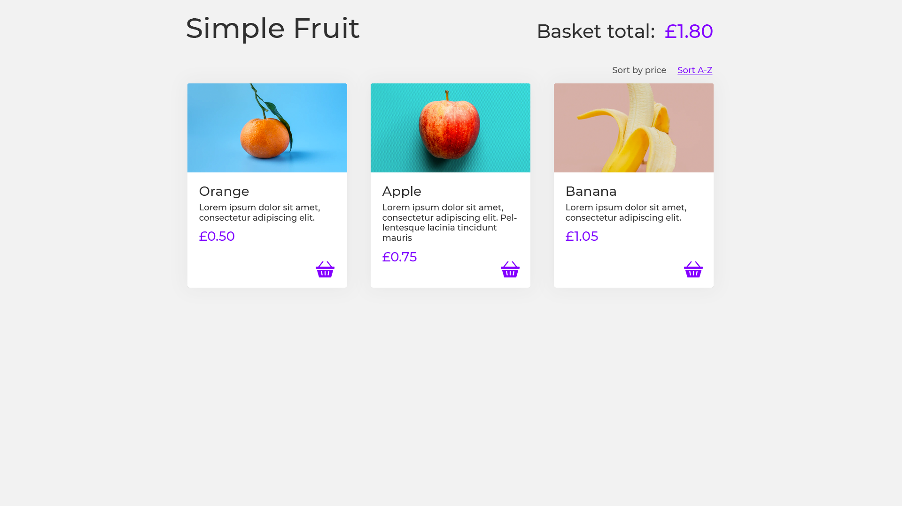
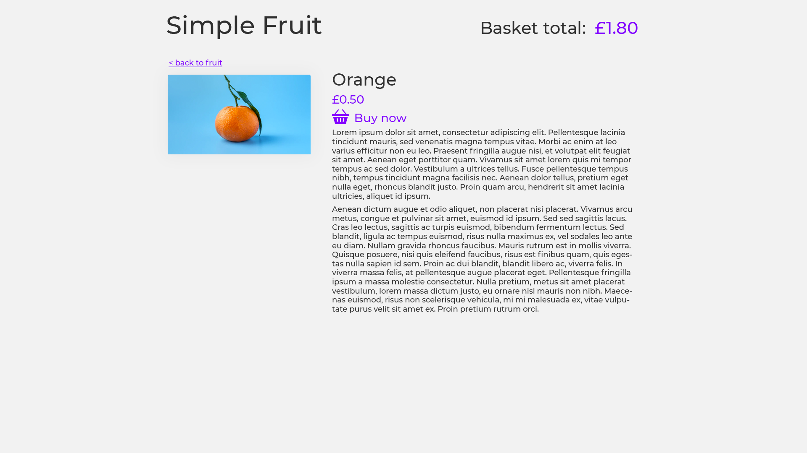

# Add to Basket

Another interview exercise.

Instructions:

- Build the 2 designs below using Angular6+, Typescript & SCSS.

- On a product, clicking on the basket icon will add the item to basket & the basket total should be updated to reflect the total costs of all items in basket

- Product can be added multiple times to the basket

- Clicking on the product image or title will take you to the product page

- Clicking on "Sort by price" will sort the products by price

- Clicking on "Sort A-Z" will sort the products by alphabetically

- Clicking on "< back to fruit" will go back to the product list page

- Create unit tests to test that the basket total is updated correctly

---

This project was generated with [Angular CLI](https://github.com/angular/angular-cli) version 9.1.7.

## Development server

Run `ng serve` for a dev server. Navigate to `http://localhost:4200/`. The app will automatically reload if you change any of the source files.

## Code scaffolding

Run `ng generate component component-name` to generate a new component. You can also use `ng generate directive|pipe|service|class|guard|interface|enum|module`.

## Build

Run `ng build` to build the project. The build artifacts will be stored in the `dist/` directory. Use the `--prod` flag for a production build.

## Running unit tests

Run `ng test` to execute the unit tests via [Karma](https://karma-runner.github.io).

## Running end-to-end tests

Run `ng e2e` to execute the end-to-end tests via [Protractor](http://www.protractortest.org/).

## Further help

To get more help on the Angular CLI use `ng help` or go check out the [Angular CLI README](https://github.com/angular/angular-cli/blob/master/README.md).
